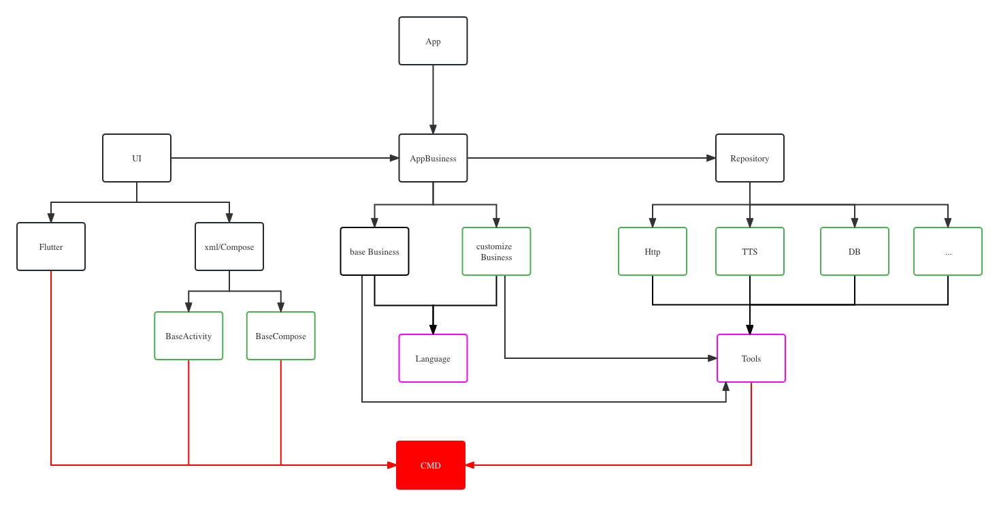

# 项目架构简介

## CMD

> 项目基础模块必须依赖
>
> 包含各个模块之间通信协议：interface、常量、javabean等

-----

## UI

> 负责显示相关界面
>
> 可以是flutter 、xml、Compse、web页面等

---

## Repository

> 功能模块
>
> 与业务无关只负责最基础的单个功能执行

---

## AppBusiness

> 业务模块 核心模块
>
> 通过该模块把ui、Repository两个模块连接起来。批量开发app的关键

----

## 其他模块

> 为了更好的拆分指责 
>
> 以下模块可以选择是否依赖
>
> 如果批量复制相同类型的app只需要修改 ui、Language模块即可

- Language

  - 负责app的名字、应用内语言

- Tools

  

